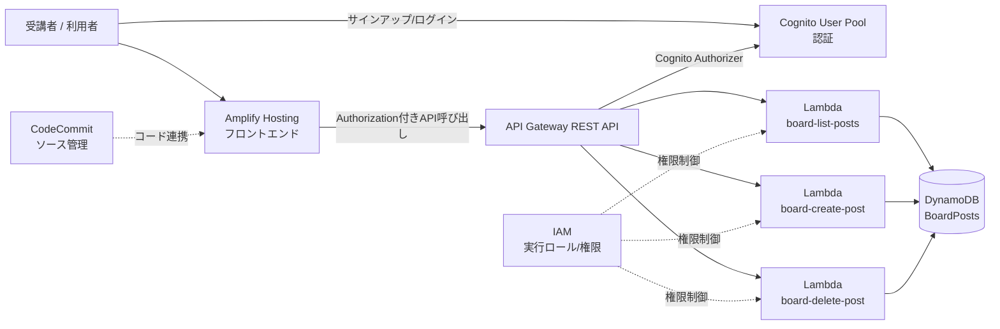

# 研修導入: 全体像と登場サービスの役割

- 前の資料: [README](../README.md)
- 次に読む資料: [構成概要](./architecture.md)

## 1. まず全体像

この研修では、次の流れで「認証付き掲示板アプリ」を完成させます。

1. 事前準備（AWSアカウント・Git環境）
2. データ保存先（DynamoDB）を用意
3. ユーザー認証基盤（Cognito）を用意
4. API処理（Lambda）を実装
5. APIの入口（API Gateway）を構成
6. ソース管理（CodeCommit）へ登録
7. 画面を公開（Amplify Hosting）
8. サインアップ・投稿・削除まで動作確認

## 2. 構成図（Mermaid）

## 3. 登場サービスの役割

- IAM
  - AWSで「誰が」「何をできるか」を管理するサービスです。
  - この研修では、作業用ユーザーとLambda実行ロールの権限設定に使います。
- DynamoDB
  - サーバーレスで使えるNoSQLデータベースです。
  - この研修では、掲示板の投稿データを保存します。
- Cognito User Pool
  - サインアップ/ログインなどのユーザー認証を提供するサービスです。
  - この研修では、認証済みユーザーだけがAPIを利用できるようにします。
- Lambda
  - サーバー管理なしでコードを実行するサービスです。
  - この研修では、投稿一覧・投稿作成・投稿削除の処理を実装します。
- API Gateway (REST API)
  - フロントエンドから呼び出すAPIの公開窓口です。
  - この研修では、HTTPリクエストをLambdaへルーティングします。
- Amplify Hosting
  - フロントエンドを簡単に公開できるホスティングサービスです。
  - この研修では、掲示板画面をインターネット公開します。
- CodeCommit
  - AWS上のGitリポジトリサービスです。
  - この研修では、教材コードの保存先として使います。

## 4. リクエストが処理される流れ

1. 利用者がAmplify Hosting上の画面にアクセス
2. ログイン時にCognitoで認証トークンを取得
3. 画面がAPI Gatewayにリクエスト送信（Authorizationヘッダー付き）
4. API GatewayがCognitoで認証し、Lambdaを呼び出し
5. LambdaがDynamoDBを読み書きし、結果を返却
6. 画面に投稿一覧や実行結果が表示される

## 5. この研修のゴール

- 認証付きで利用できる掲示板アプリをAWS上に構築できる
- API・認証・DB・ホスティングの連携ポイントを説明できる
- 最低限のIAM権限設計（実行ロールとアクセス許可）を理解できる
